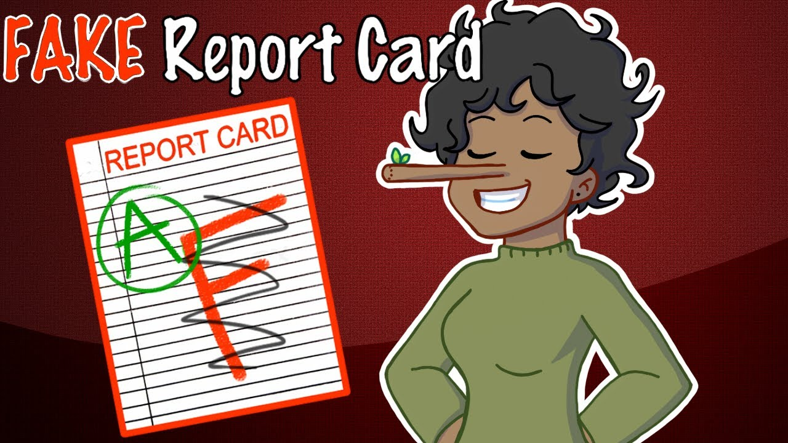

## The fake report card

I failed the first quarter of a class in middle school, so I made a fake report card. I did this every quarter that year. I forgot that they mail home the end-of-year cards, and my mom got it before I could intercept with my fake. She was PISSED—at the school for their error. The teacher also retired that year and had already thrown out his records, so they had to take my mother’s “proof” (the fake ones I made throughout the year) and “correct” the “mistake.” I’ve never told her the truth.

Since then I never ever lied to my mother again,watching her fight for me  
even if it was all a big lie made me understand her Love for me.  
But with other people in general I try always to lie to reach my goals.
